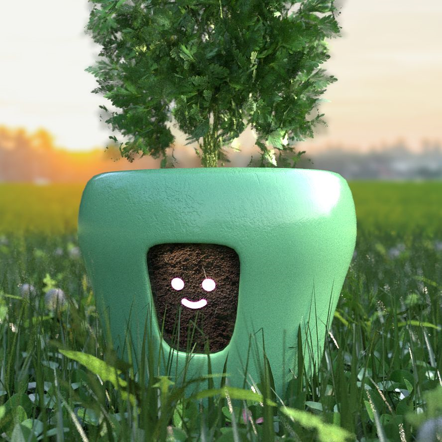

# BotsAreStupid 1.0-pre-alpha - main branch 

R.E. of ITCH.io ReechAndHait "special game dev project". ;)

## Screenshots

## Status
- NET 4.8 used
- Project builded but damaged (100500 bugs after veery fast & dirty  R.E.!) 
- Work-in-progress? (maybe yes, may be null!))))

## ToDo
- Fix 100500 bugs
- Refactor code 
- Add somecool music for dev deals, hehe (see Lukas Schönwiese  https://soundcloud.com/lukas-schoenwiese, Bots Are Stupid - Official Game Score theme))))

## .
As is. No support. DIY. Learn purposes only.

## Reference(s)

- https://lelegolla.itch.io/bots-are-stupid Original project (some neweest .NET used... bad for old retro-PCs)
- https://oki.hateblo.jp/entry/Bots_Are_Stupid
- https://steambase.io/games/best-coding-steam-linux-games
- https://links.goldstein.rs/tag/about-programming

## ..
[m][e] March 2025

